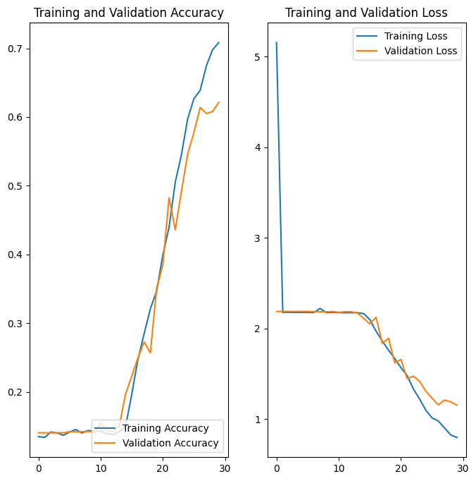

# Melanoma Detection
> Build a multiclass classification model using a custom convolutional neural network in TensorFlow.

## Table of Contents
* [Problem Statement](#problem-statement)
* [Dataset](#dataset)
* [Model Evaluation](#model-evaluation)
* [Technologies Used](#technologies-used)

<!-- You can include any other section that is pertinent to your problem -->

## Problem Statement
Build a CNN based model which can accurately detect melanoma. Melanoma is a type of cancer that can be deadly if not detected early. It accounts for 75% of skin cancer deaths. A solution that can evaluate images and alert dermatologists about the presence of melanoma has the potential to reduce a lot of manual effort needed in diagnosis.

## Dataset

The dataset consists of 2239 images of malignant and benign oncological diseases, which were formed from the International Skin Imaging Collaboration (ISIC). All images were sorted according to the classification taken with ISIC, and all subsets were divided into the same number of images. The data set contains the following diseases:

- Actinic keratosis
- Basal cell carcinoma
- Dermatofibroma
- Melanoma
- Nevus
- Pigmented benign keratosis
- Seborrheic keratosis
- Squamous cell carcinoma
- Vascular lesion

## Model Evaluation

Final model evaluation after applying augmentation

.

## Technologies Used
- Google Colab
- Tensorflow
- Keras
- Matplotlib.pyplot
- Numpy
- Pandas